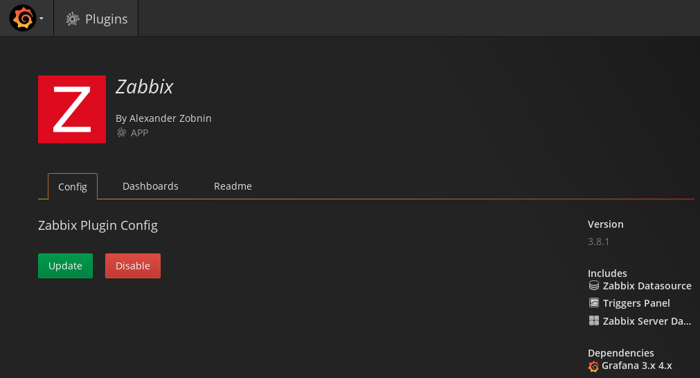
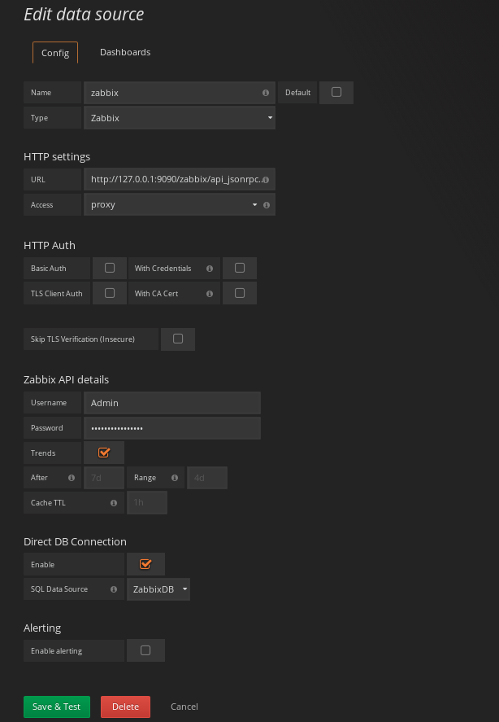
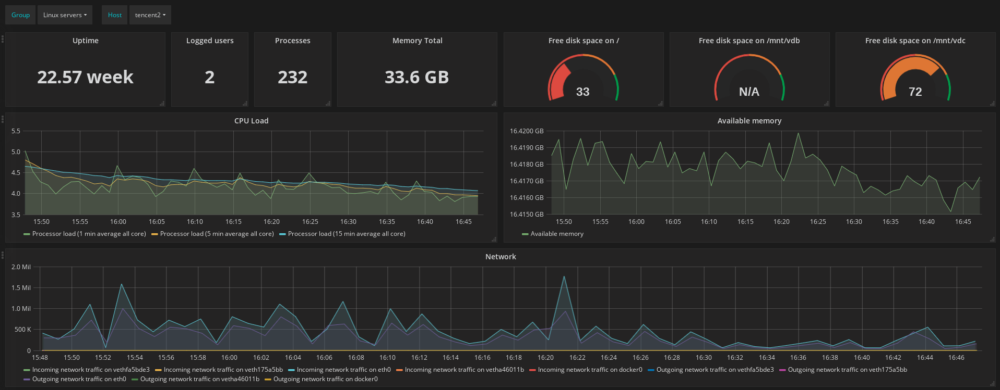

Zabbix： 企业级的，开源的，分布式的监控系统，重量级选手，功能齐全

Grafana： 数据可视化平台，可以用于显示监控数据，支持多种数据源，比如InfluxDB、Prometheus、Graphite等数据源


## 安装Mariadb10.2

1. 添加MariaDB YUM源。

    在`/etc/yum.repos.d/`目录下新建`MariaDB.repo`文件，文件内容如下
    ```
    # MariaDB 10.2 CentOS repository list - created 2018-02-09 07:43 UTC
    # http://downloads.mariadb.org/mariadb/repositories/
    [mariadb]
    name = MariaDB
    baseurl = http://yum.mariadb.org/10.2/centos7-amd64
    gpgkey=https://yum.mariadb.org/RPM-GPG-KEY-MariaDB
    gpgcheck=1
    ```

1. 安装

    ```bash
    sudo yum install MariaDB-server MariraDB-client
    ```

1. 启动

    ```bash
    systemctl start mariadb
    systemctl enable mariadb
    ```

MariaDB安装之后，`root`用户默认密码是空的，可以通过执行`mysql_secure_installation`进行相关的安全设置

## 安装Zabbix server

1. 安装YUM源

    ```bash
    rpm -ivh http://repo.zabbix.com/zabbix/3.4/rhel/7/x86_64/zabbix-release-3.4-2.el7.noarch.rpm
    ```

1. 安装

    ```bash
    yum install zabbix-server-mysql
    yum install zabbix-web-mysql
    ```

1. 创建数据库

    ```bash
    shell> mysql -uroot -p<password>
    mysql> create database zabbix character set utf8 collate utf8_bin;
    mysql> grant all privileges on zabbix.* to zabbix@localhost identified by '<password>';
    mysql> quit;
    ```

1. 导入表

    ```bash
    zcat /usr/share/doc/zabbix-server-mysql*/create.sql.gz | mysql -uzabbix -p zabbix
    ```

1. 修改配置文件中数据库配置

    ```
    # vim /etc/zabbix/zabbix_server.conf
    DBHost=localhost
    DBName=zabbix
    DBUser=zabbix
    DBPassword=<password>
    ```

1. 配置Zabbix web时区

    Zabbix前端配置位于`/etc/httpd/conf.d/zabbix.conf`，修改里边时区的配置

    ```
    php_value date.timezone Asia/Shanghai
    ```

1. 启动

    ```bash
    systemctl start zabbix-server
    systemctl enable zabbix-server
    systemctl start httpd
    systemctl enable httpd
    ```

1. 访问

    ```
    http://server_ip_address/zabbix
    ```
    进行相关的配置后进入管理页面，默认用户名密码是： Admin/zabbix

    Zabbix API路径是`zabbix/api_jsonrpc.php`

## 安装Zabbix agent

`Agent`收集监控主机的数据发送给`Server`


如果没有安装`Zabbix`源，先执行安装YUM源

1. 安装Zabbix agent

    ```bash
    yum install zabbix-agent
    ```

1. 配置agent

    修改agent配置中的server地址和其他配置
    ```
    # vim /etc/zabbix/zabbix_agentd.conf
    Server=x.x.x.x
    ServerActive=x.x.x.x
    # Hostname=Zabbix server
    HostnameItem=system.hostname
    ```

1. 启动

    ```bash
    systemctl start zabbix-agent
    systemctl enable zabbix-agent
    ```

## Grafana

Zabbix自带的图形查看界面比较简洁，庆幸的是它对外提供了API，并且Grafana有插件支持Zabbix，我们可以采用Grafana显示Zabbix的数据

1. 安装

    ```bash
    wget https://s3-us-west-2.amazonaws.com/grafana-releases/release/grafana-4.6.3-1.x86_64.rpm 
    yum local install grafana-4.6.3-1.x86_64.rpm 
    ```

1. 启动

    ```bash
    systemctl start grafana-server
    systemctl enable grafana-server
    ```

    `Grafana`使用`3000`端口，默认用户名/密码： admin/admin

1. 安装Zabbix插件

    项目地址[在此](https://github.com/alexanderzobnin/grafana-zabbix)

    ```bash
    grafana-cli plugins install alexanderzobnin-zabbix-app
    systemctl restart grafana-server
    ```

1. 启用Zabbix插件：

    

1. 添加数据源

    

最后是自己制作的显示图



`Grafana`的绘图可以参考[Grafana官方文档](http://docs.grafana.org/features/panels/)

## 参考

- [Zabbix官方文档](https://www.zabbix.com/documentation/3.4/manual)
- [Grafana官方文档](http://docs.grafana.org/)
- [Grafana-Zabbix文档](http://docs.grafana-zabbix.org/)